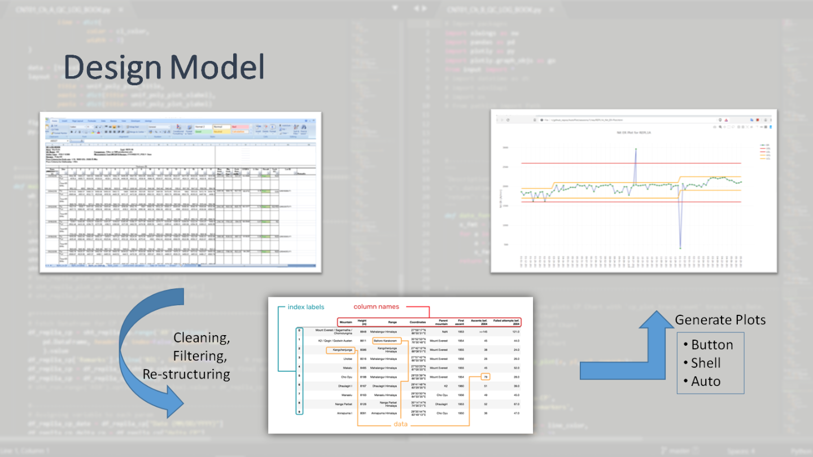

# AutoPlot
Generate plots automatically from Excel data -----"Just press a Button"

  

## Installation
Click [here](./Installation)

## Design Model

## Examples
Click [here](./examples)

### Troubleshooting
* <u>__Date:__</u> There could be a problem with Date format, which might have happened during data entry.
* <u>__Control limit:__</u> If the chart is not updated till the last row of data, then please check for missing data in the Control limits parameters for that row. This is also applicable for any missing data not shown in the chart.

## Modules
Click [here](./modules.md)

## Scripts
Click [here](./scripts)

## REFERENCES
* [Control Chart Rules and Interpretation](https://www.spcforexcel.com/knowledge/control-chart-basics/control-chart-rules-interpretation)