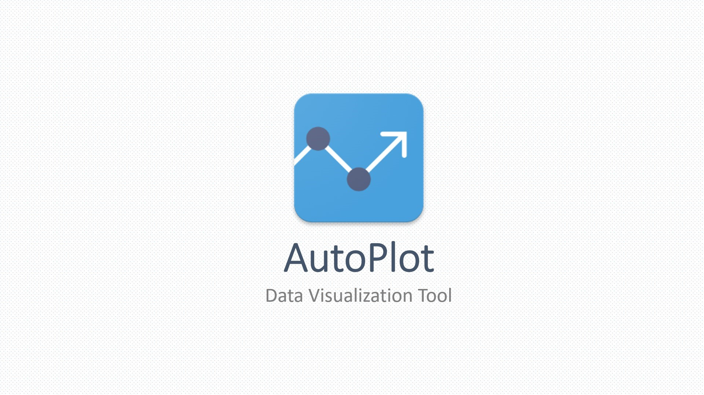
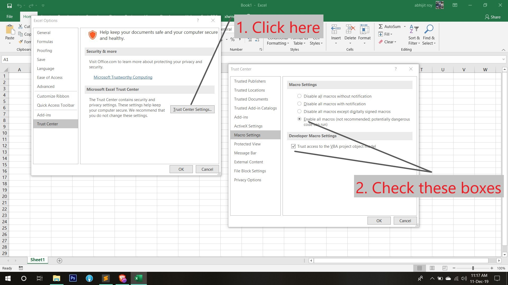
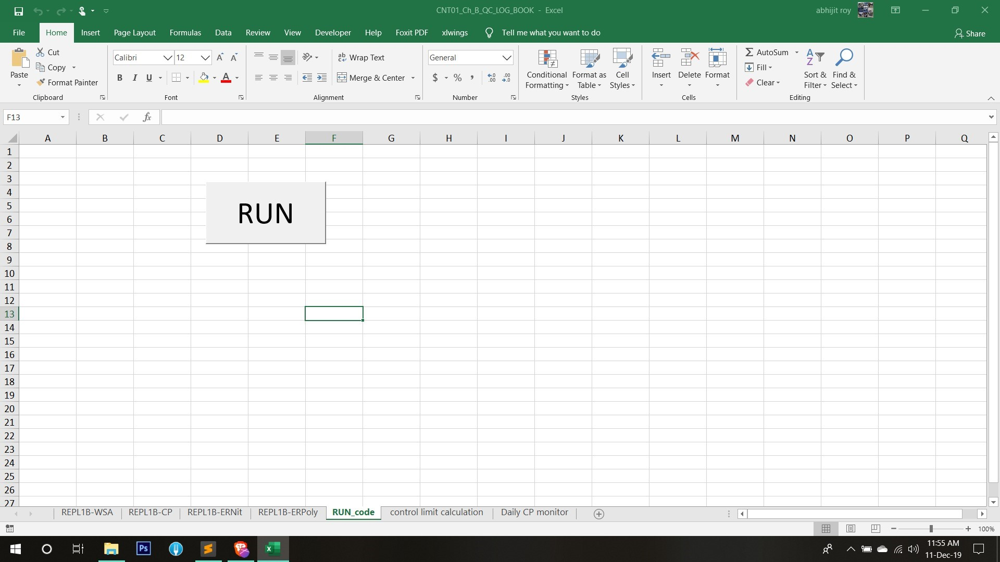

# AutoPlot

<p align="center">
  
</p>

<div style="page-break-after: always;"></div>

## Table of Contents
* Installation
* Implementation
* Chart Features
* Troubleshooting

<div style="page-break-after: always;"></div>

## Installation
Both the Softwares doesn't need any `ADMIN` permission.

### Anaconda
* Download and Install [Anaconda](https://www.anaconda.com/distribution/#download-section). Also, kept in the local directory here - `"\\vmfg\VFD FILE SERVER\TEMPORARY JUNK AUTO DELETE\abhijit\MySoftwares\AutoPlot\Installation\setup_files"`.

> NOTE: Don't forget to tick the command terminal option (which is NOT recommended) in the last prompt.

<p align="center">
  
</p>

* Install packages. Go to directory inside this folder - `"\\vmfg\VFD FILE SERVER\TEMPORARY JUNK AUTO DELETE\abhijit\MySoftwares\AutoPlot\Installation"` and run `auto_install.bat`
	```markdown
	pywin32
	xlwings
	retrying
	plotly
	```

<p align="center">
  
</p>

* Enable macro settings in MS Excel's options menu.
<p align="center">
  
</p>

* Integrate `xlwings` with Excel. It would appear in separate tab inside Excel application. Please close all the Excel files before doing this.
<p align="center">
  
</p>


Now, Excel is Integrated with Python.

### Chart auto-updation
Due to the incompatability issue of Windows Operating System in local Intranet, the charts (which opens in the browser) doesn't create/update the charts in the same directory.

So, [Fork](https://git-fork.com/) application needs to be installed for executing the shell (`.sh`) [Analogous to `.bat` in Windows] file. Also, kept in the local directory here - `"\\vmfg\VFD FILE SERVER\TEMPORARY JUNK AUTO DELETE\abhijit\MySoftwares\AutoPlot\Installation\setup_files"`.

<p align="center">
  
</p>


<div style="page-break-after: always;"></div>

## Implementation
### QC charts
This has been implemented in different case studies like __Dry Etch__, __Wet Etch__, __Diffusion__ so far.

* ##### M-1: `button-mode` - Open the Excel file and press <kbd>RUN</kbd> button present in __RUN_code__ sheet. This opens the charts in the default Browser.

	> NOTE: Unfortunately, due to Windows incompatibility for local intranet during execution, the charts are not updated in the same directory. For this, follow __M-2__.

<p align="center">
  
</p>


* ##### M-2: `shell-mode`

<p align="center">
  
</p>


<!-- ### Control limits calculation -->
<!-- ### Wafer Map -->

<div style="page-break-after: always;"></div>

## Chart Features
* Show closest data on hover
<p align="center">
  
</p>

* Compare data on hover
<p align="center">
  
</p>

* See __"Remarks"__ in the chart
<p align="center">
  
</p>
* Zoom-in/out from the center of chart
<p align="center">
  
</p>
* Zoom-in/out a section of chart
<p align="center">
  
</p>
* Save the png file
<p align="center">
  
</p>

<div style="page-break-after: always;"></div>

## Troubleshooting
There could be errors due to data entry in Excel file by user.

* Date issue
<p align="center">
  
</p>

* Control limits missing issue
In this case, just ensure that the control limits are present in the excel sheet upto the latest date.

<div style="page-break-after: always;"></div>
