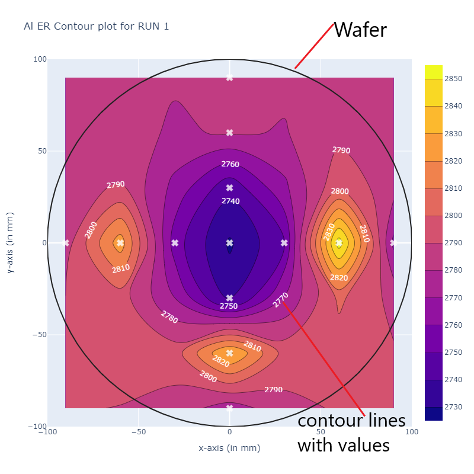
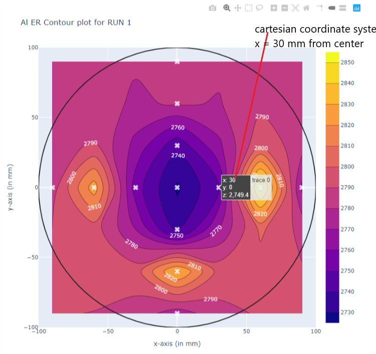
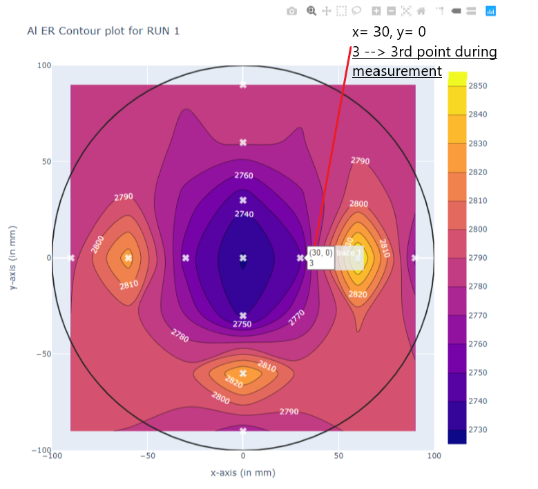
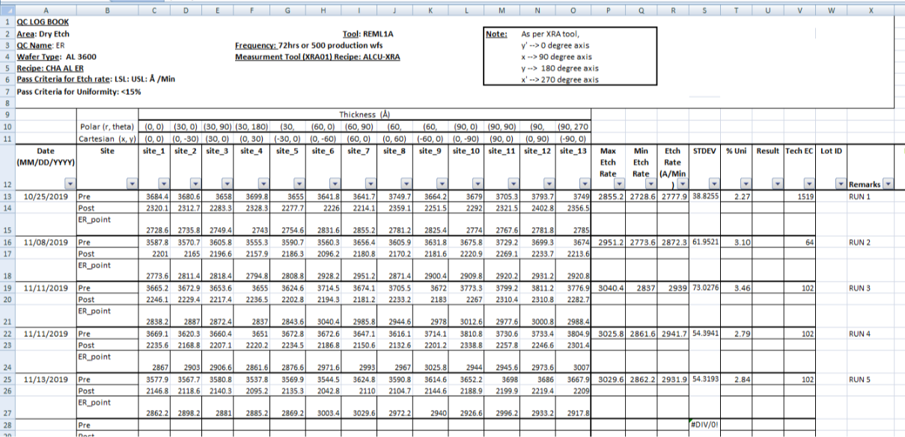
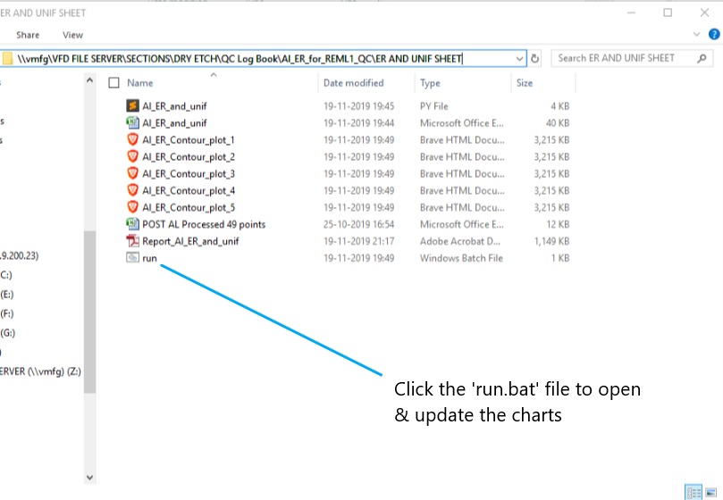

# REML1 Al ER Analysis on XRA vs MTRS1
## Contour Plot Explained
### 1

### 2

### 3

## Equipment-1: XRA
### Excel file data in XRA

### Contour Plots for Al Etch Rate (ER) in 5 Runs
### RUN-1

### RUN-2

### RUN-3

### RUN-4

### RUN-5

## Execution
* Click the `run.bat` file to open/update the charts.
